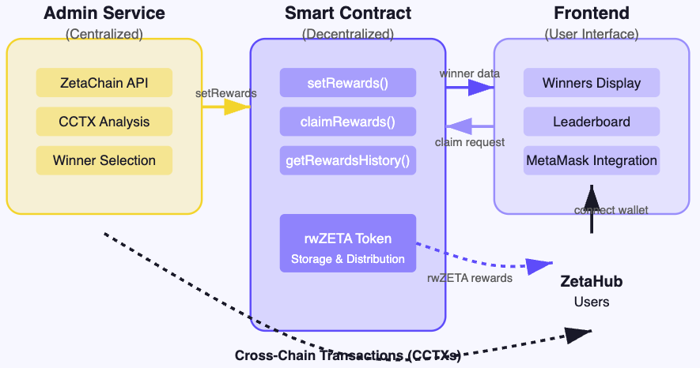
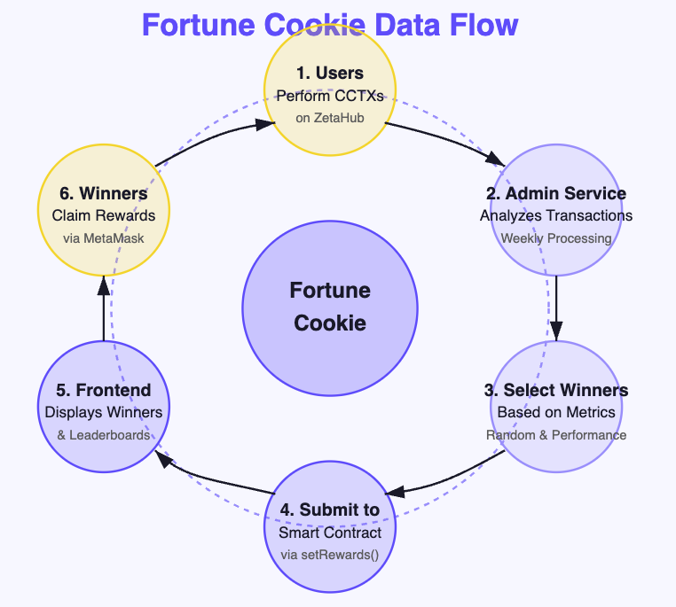

# 🍪 Fortune Cookie

## 🎯 Bringing a Bit Fun to Cross-Chain Transactions on ZetaChain

 

## 👥 Our Team

| Name | Role |
|------|------|
| **Tanmay** | Backend |
| **SrdJan Simonovic** | Smart Contract |
| **Charlie Chen** | Frontend |

 

## 🤔 What is Fortune Cookie?

Fortune Cookie is a ZetaHub extension that adds a layer of excitement to cross-chain transactions by rewarding users based on various metrics.

- **1. 🏆 Weekly rewards:** for users performing cross-chain transactions (CCTXs)

- **2. 🎮 Gamifies the ZetaChain experience** and enhances user engagement
 
- **3. 🤝 Creates a lively community atmosphere** by adding an element of chance and skill
 
- **4. 📣 Supports ZetaChain's marketing efforts** by incentivizing specific CCTXs.

 
> 🍪 Just like a fortune cookie brings an unexpected treat, our project delivers surprise rewards to lucky CCTX users!

 
 

## 🎯 Why Fortune Cookie?

| Icon | Benefit | Description |
|------|---------|-------------|
| 🚀 | Enhances User Experience | Adds fun and excitement to an otherwise technical process |
| 🌱 | Encourages Adoption | Motivates new users to try cross-chain transactions |
| 🔄 | Drives Network Activity | Increases transaction volume across chains |
| 🌐 | Builds Community | Creates talking points and shared experiences among users |

 
 

## 🎲 How It Works

### 📅 Weekly Draws
Based on statistics, we select winners from the pool of CCTX every week

### 🏅 Multiple Winning Categories
- **🎲 Lucky CCTX** - Randomly selected CCTXs (VRF-powered)
 

- **⚡ Finality Flash** - Fastest CCTX finality time per chain
 

- **🐢 Tortoise Trophy** - Slowest CCTX finality time per chain
 

- **👻 Gas Ghost** - Lowest gas fee CCTX per chain

### Other Winning Categories

- **CCTX created by XP user base**
 

- **5 CCTXs from different chains that finalized in the same ZetaChain block**
 

- **CCTX that hits all connected chains**
 

- **User pay highest gas fee**

 
 

## 🎳 Unpredictable & Fair

Winners are unpredictable because:
- **🎲 Random Selection** - VRF (Verifiable Random Function) ensures the randomness
 

- **⏱️ Unpredictable Metrics** - Transaction speed and gas prices are unpredictable

 
 

## 💰 Reward Token: rwZETA

- **🔧 Flexible** - rwZETA is pegged to ZETA but allows for flexibility
 

- **🔄 Conversion Rate** - Configurable rate between rwZETA and ZETA
 

- **🚀 Future Expansion** - Possibility for staking, swap, etc.

 
 

## 🏗️ System Architecture

### Three-Component System

1. **🖥️ Off-chain Admin Service** (Centralized)
   - Analyzes CCTX statistics weekly
   - Selects winners based on configured metrics
   - Submits winner data to smart contract

2. **📜 Smart Contract** (Decentralized)
   - Stores winner information securely on-chain
   - Manages reward distribution
   - Provides transparent reward history

3. **🌍 User-Friendly Frontend** (Decentralized Interface)
   - Displays winners by category
   - Shows leaderboards for top earners
   - Allows winners to claim rewards with MetaMask

 
 

## 🔄 Data Flow

1. 👥 Users perform cross-chain transactions
2. 🕵️ Admin service analyzes transactions weekly
3. 🏆 Winners and reward amounts are submitted to smart contract
4. 📊 Frontend displays winners and leaderboards
5. 💳 Winners connect wallets and claim rewards
6. 💰 Smart contract distributes rwZETA tokens

 
 

## 🎮 Demo & Features

[Fortune Cookie UI](https://fortune-cookie-fe-git-mainnet-ws4charlies-projects.vercel.app/)

- **📊 Leaderboard** - Showcases top earners and most frequent winners
 

- **📜 Weekly Winner History** - View past rewards and metrics
 

- **🏷️ Category Tabs** - Filter winners by reward type
 

- **🖱️ Claim Process** - Simple one-click reward claiming

 
 

## 🙏 Thank You!

**🍪 Fortune Cookie**: Making cross-chain transactions more rewarding
